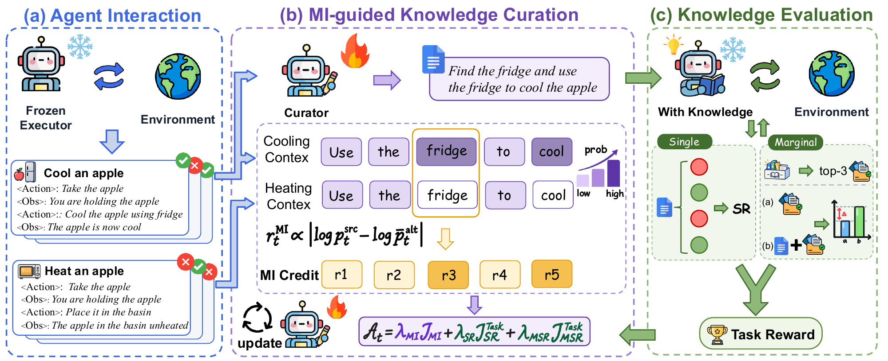

<h1 align="center">Learning to Accumulate Knowledge<br>with Mutual Information</h1>

<p align="center">
  <a href="https://arxiv.org/abs/2610.10042"></a>
  <a href="https://github.com/LaoKuiZe/Knowledge-Weaver"></a>
  <a href="LICENSE"></a>
</p>

**Knowledge Weaver** trains a curator to turn agent trajectories into reusable knowledge while keeping the task executor frozen. The curator learns to accumulate reusable knowledge through mutual-information-inspired feedback. This repository provides the full pipeline — **training**, **knowledge-bank construction**, and **evaluation** — on **ALFWorld** and **WebShop**, using **Qwen3.5-4B** as both the frozen executor and the initial curator.

<p align="center">
  
</p>

## 🚀 Setup

### Requirements

- **Software:** Linux x86_64, Python 3.12, [uv](https://docs.astral.sh/uv/), NVIDIA CUDA drivers, and Java 11+.
- **GPUs:** training uses 8 GPUs.

### Installation

```bash
git clone https://github.com/LaoKuiZe/Knowledge-Weaver.git
cd Knowledge-Weaver
bash scripts/setup_env.sh
source .venv/bin/activate
```

### Data

**[ALFWorld](https://github.com/alfworld/alfworld#quickstart)**

```bash
alfworld-download --data-dir "$PWD/data/alfworld"
```

**[WebShop](https://github.com/princeton-nlp/WebShop#setup)**

```bash
python AReaL/examples/webshop_skill/prepare_data.py \
  --mode full --download-source google-drive --data-root "$PWD/data/webshop"
```

- **ALFWorld:** set `ALFWORLD_DATA_ROOT` to the `json_2.1.1` directory. This also overrides the evaluation data path.
- **WebShop:** set `WEBSHOP_DATA_ROOT` to the directory containing `items_shuffle.json`, `items_ins_v2.json`, `items_human_ins.json`, and `search_engine/indexes`.

## 🧠 Training

**ALFWorld**

```bash
bash scripts/train.sh alfworld
```

**WebShop**

```bash
# Terminal 1: start the environment service and keep it running.
source .venv/bin/activate
bash scripts/serve_webshop.sh

# Terminal 2: launch training.
source .venv/bin/activate
bash scripts/train.sh webshop
```

Training configs can be found in [ALFWorld](configs/train_alfworld.yaml) and [WebShop](configs/train_webshop.yaml).

ALFWorld training runs each TextWorld environment in its own subprocess (`ALFWORLD_ISOLATE_ENV_PROCESS=1` by default), so a native crash fails and retries one episode instead of the whole rollout pool. Failed rollouts keep their tracebacks in `diagnostics/rollout_failure_*.json` under each outcome condition.

Checkpoints are saved under `checkpoints/checkpoints/$USER/knowledgeweaver-<task>/<trial>/default/`.

To resume an interrupted run, stop any processes left over from it, then relaunch with the same trial name, e.g. `TRIAL_NAME=train_20261005_120000 bash scripts/train.sh alfworld`. Training restarts from the last recovery checkpoint (every 2 steps for ALFWorld, 10 for WebShop); artifacts from later steps are moved to `recovery_rollbacks/` in the run's output directory and those steps are replayed.

## 📚 Knowledge Bank Construction

Build a 50-entry knowledge bank from frozen-executor trajectories using a **trained checkpoint** or an **API model**.

**From a trained checkpoint**

Set `CURATOR_MODEL` to a checkpoint directory saved by training:

```bash
CURATOR_MODEL=checkpoints/checkpoints/$USER/knowledgeweaver-alfworld/TRIAL_NAME/default/STEP_DIR \
  bash scripts/build_knowledge_bank.sh alfworld
```

Replace `alfworld` with `webshop` for WebShop.

**From an API**

Set the model, endpoint, and API key.

```bash
# ALFWorld
ALFWORLD_API_MODEL=your-model \
ALFWORLD_API_BASE_URL=https://your-endpoint/v1 \
ALFWORLD_API_KEY=your-key \
  bash scripts/build_knowledge_bank.sh alfworld

# WebShop
WEBSHOP_API_MODEL=your-model \
WEBSHOP_API_BASE_URL=https://your-endpoint/v1 \
WEBSHOP_API_KEY=your-key \
  bash scripts/build_knowledge_bank.sh webshop
```

**Output paths**

- **ALFWorld:** `outputs/knowledge_bank/alfworld/all.jsonl`
- **WebShop:** `outputs/knowledge_bank/webshop/all.jsonl`

Set `BANK_OUTPUT_PATH=/path/to/bank.jsonl` to specify a different output file for either benchmark.

## 📊 Evaluation

Evaluate a knowledge bank with the frozen executor on alfworld and webshop test set.

```bash
# ALFWorld
bash scripts/eval.sh alfworld \
  --skillbank outputs/knowledge_bank/alfworld/all.jsonl \
  --output-dir outputs/eval/alfworld \
  --top-k 10

# WebShop
bash scripts/eval.sh webshop \
  --skillbank outputs/knowledge_bank/webshop/all.jsonl \
  --output-dir outputs/eval/webshop \
  --top-k 10
```

- `top-k`: number of retrieved entries, default value is `10`.
- `output-dir`: directory to save the evaluation results.

## 🌟 Citation

If you find our work useful, please consider citing:

```bibtex
@article{zhao2026learning,
  title   = {Learning to Accumulate Knowledge with Mutual Information},
  author  = {Zhao, Yuyang and Liao, Lizi and Shen, Leyang and
             Zhao, Xiaoyan and Zhang, Yang and Feng, Fuli and He, Xiangnan},
  journal = {arXiv preprint arXiv:2610.10042},
  year    = {2026}
}
```

## 🙏 Acknowledgements

This project builds on [AReaL](https://github.com/areal-project/AReaL), [ALFWorld](https://github.com/alfworld/alfworld), [WebShop](https://github.com/princeton-nlp/WebShop), and [Qwen](https://huggingface.co/Qwen/Qwen3.5-4B). We thank their authors and contributors for sharing the training framework, environments, and models that make this work possible.

## 📄 License

Knowledge Weaver's code, including our modules inside `AReaL/`, is released under the [MIT License](LICENSE). Files from AReaL keep their Apache-2.0 license, and the ones we modified carry a notice. See [THIRD_PARTY.md](THIRD_PARTY.md) for third-party components.
